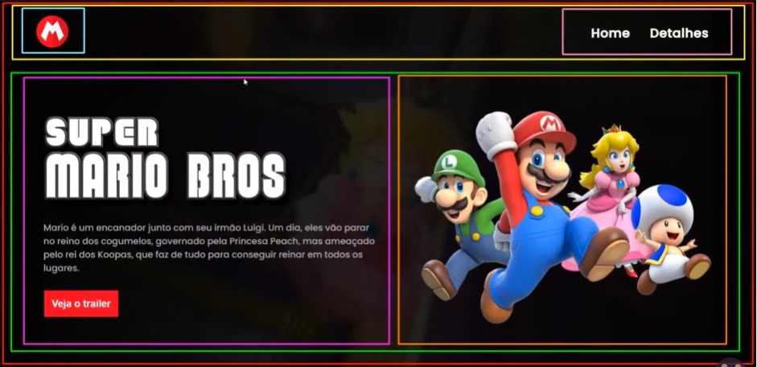

# projeto-mario

**link do projeto**
https://jefitoifto.github.io/projeto-mario/src/index.html

**Em construção**🚧

<h1>
    
    
Projeto de criação de uma página web do filme  super Mario
 
</h1>

## 📚 About

Nesse projeto vou apresentar os conceitos básicos de html5 e css3, com a criação de uma página web do filme **O Super Mario**. Também irei utilizar o JavaScript mais a frente.

## ⛏️ Tool

- VScode

## 📊 planning

**HTML**

-Primeiramente, montei a estrutura separando por as tags cada parte do site.
-Em seguida fui adicionando atributos às tags.
-E por fim adicionei as imagens, vídeo, título e demais informações que compõem a página.

**CSS**

-Iniciei a estilização da página 20/01
-Foram adicionados vídeo, interaçã com os botões (hover) e o conteúdo foi totalmente centralizado 
-Adicionei novas fontes e bordas, alinhei todo o conteúdo
-Algumas decorações inclusive descobri o fundo linear-gradient, que foi muito importante para o meu vídeo de fundo ficar mais opaco, e não atrapalhar a navegação. (Site gradient css)
- Responsivo também finalizado

PRÓXIMO PASSO JavaScript

23/01

JavaScript finalizado.
-modal implantada
-ao clicar em trailer, abrirá a modal com o vídeo do trailer.
Projeto Finalizado
